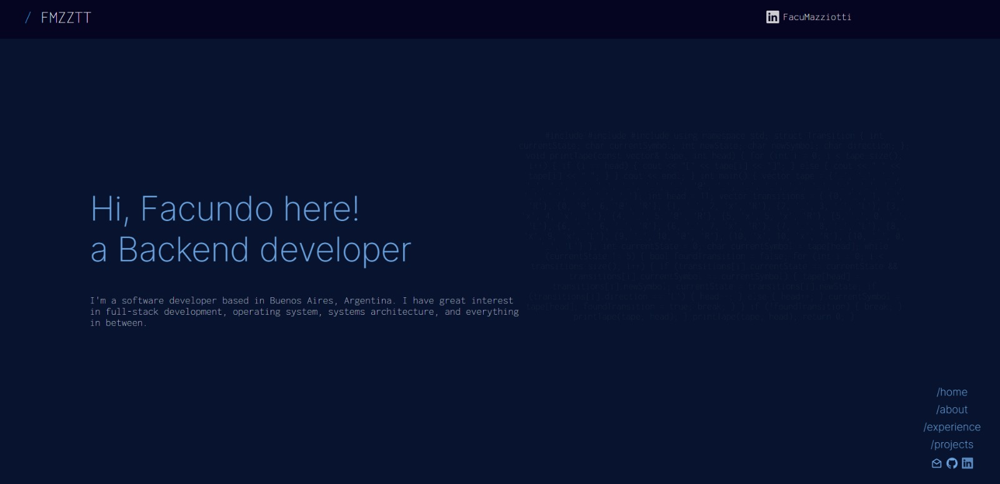

# Hello there!

<div align="center">
    
</div>


### This is the first iteration of [fmazziotti.com - v1](https://fmazziotti.com/)



### 🛠 if you have any recommendation do not hesitate in pulling a request!

1. clone the repo into your computer.

   ```sh
   git clone https://github.com/trashfacu/Portfolio.git
   ```

2. Then when your add your code please push it into a new branch

   ```sh
   git checkout -b new-branch-name
   git git commit -am "commit message"

   ```

### 🚀 and finally push it to the repo

   ```sh
   git push origin new-branch-name
   ```

### 🎨 color codes

| Color Name | Hex Code |
|------------|----------|
| Background  | `#08142f` |
| White | `#ffffff` |
| Light Blue  | `#6ca3e1` |
| Light Gray  | `#c6ccdf` |

## Thanks!